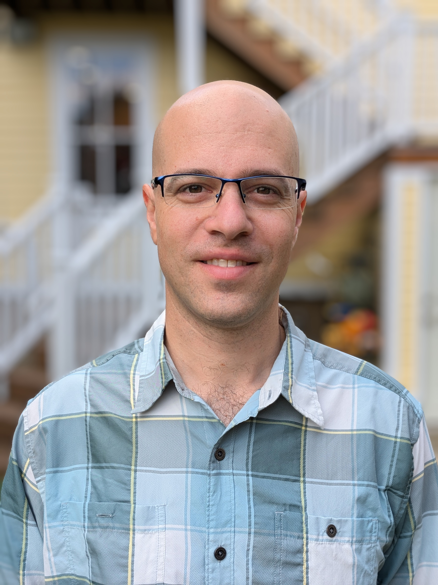
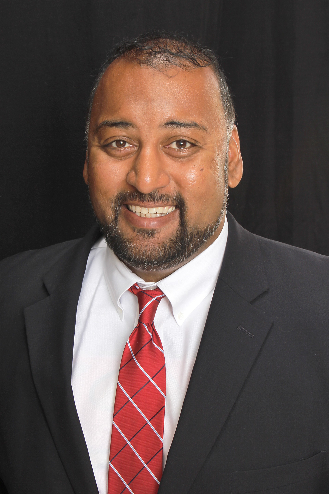
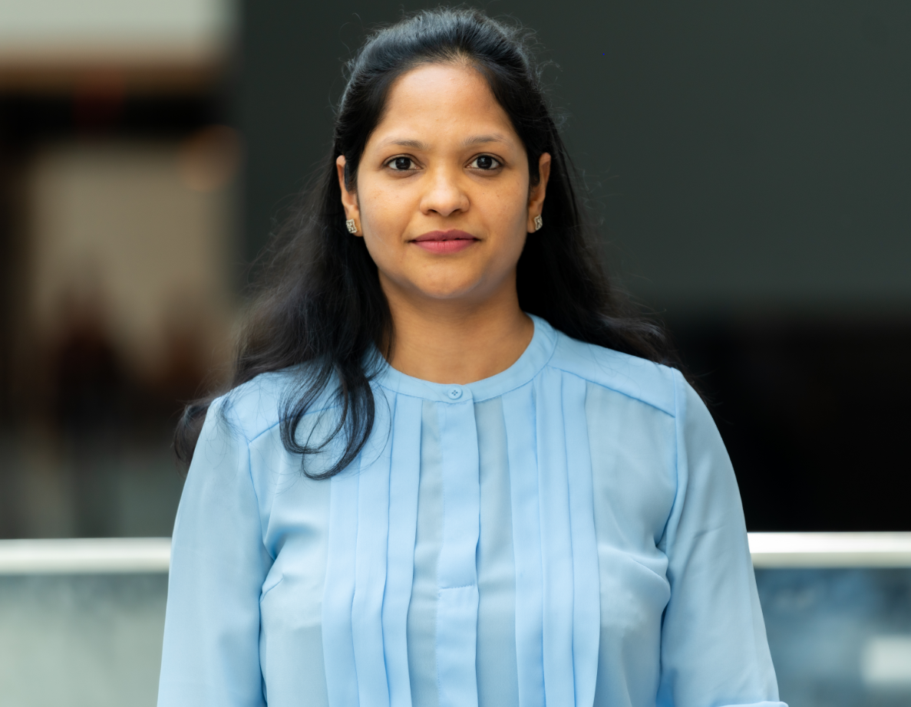
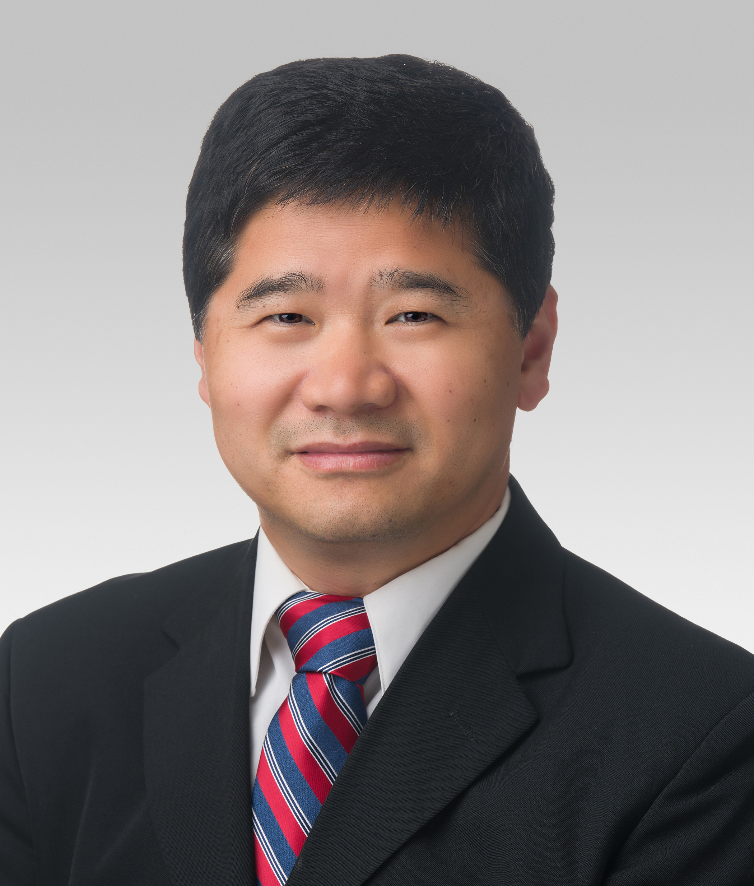
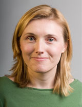
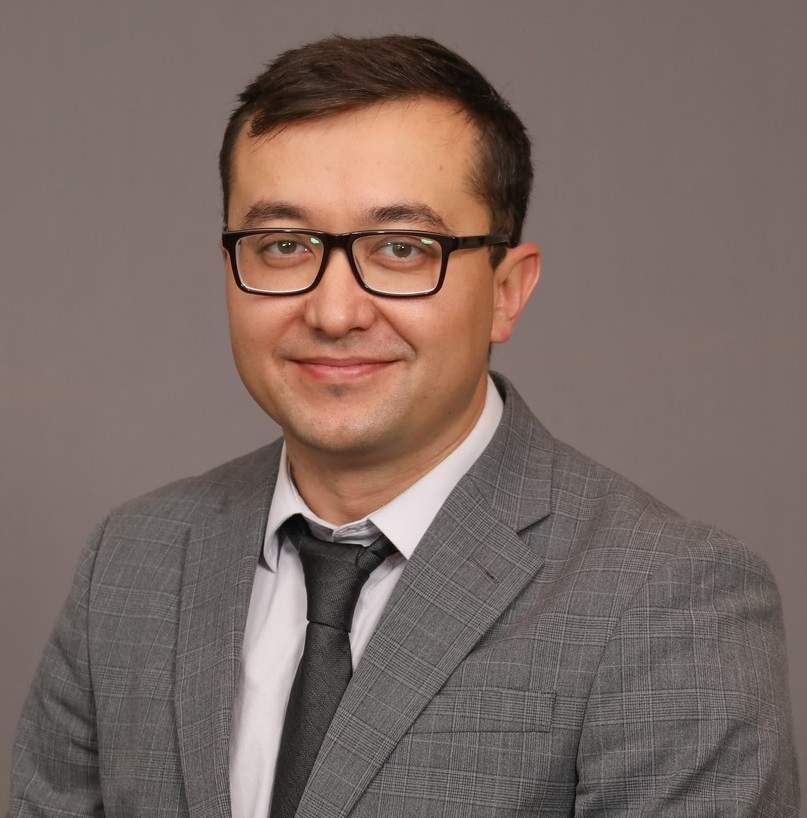

Below are the judges confirmed for DataFest 2026. These distinguished professionals and faculty bring expertise across AI, healthcare, statistics, and industry practice.

::: {.guest-card}
::: {.guest-photo}
{alt="Daniel Kirsner"}
:::

Judge

## Daniel Kirsner

AI/ML Lead at JPMorganChase

Daniel Kirsner has a PhD in Bayesian Statistics from UC Santa Cruz. He specializes in synthesizing machine learning, optimization, and traditional statistical approaches to make better decisions at scale.

Read more

His experience at JPMorganChase includes cobrand credit card acquisitions, the supply chain of physical currency, and ATM fleet optimization. Away from work, he can usually be found in Oak Park playing his tuba or tending to his garden.

:::

::: {.guest-card .left}
::: {.guest-photo}
{alt="Kumar Murukurthy"}
:::

Judge

## Kumar Murukurthy

AI Executive, Chief Clinical Officer, Optimum Healthcare

Kumar Murukurthy is a distinguished leader in the healthcare sector with over 25 years of experience, known for his expertise in data governance and analytics.

Read more

His roles as VP of IT/CIO at CommonSpirit, CIO at Walmart, CIO of Altais/Blue Shield, and Chief Clinical Officer of Optimum HIT highlight his ability to enhance patient care through effective data integration. Kumar excels in engaging stakeholders to create solutions that prioritize patient experience and satisfaction.

His skills in project management and strategic planning enable him to deliver sustainable, efficient solutions that align with organizational goals. Passionate about technology and continuous improvement, Kumar remains at the forefront of healthcare IT, driving positive change and shaping the future of the industry.

:::

::: {.guest-card}
::: {.guest-photo}
{alt="Monica Mittal"}
:::

Judge

## Monica Mittal

Senior Data Scientist in Applied AI and ML, JPMorganChase

Dr. Monika Mittal has a PhD in Physics and over 15 years of experience working with large-scale scientific and enterprise data. She spent more than a decade as a Postdoctoral Researcher at CERN, where she contributed to advanced Particle Physics research associated with the Nobel Prize–winning discovery of the Higgs boson.

Read more

At CERN, her work focused on extracting insights from massive experimental datasets using advanced statistical and computational techniques for the precise measurement of Vector Boson Fusion at CMS and ATLAS experiment. She also led development efforts at the detector edge.

Transitioning from fundamental science to industry, Monika now applies her expertise in machine learning, predictive modeling, and data-driven decision systems to solve complex business problems. She specializes in working with regulatory and compliance-related data, leveraging large language models (LLMs), agentic AI, and RAG systems to automate analysis, extract knowledge from complex documents, and support intelligent decision-making. Monika is passionate about building scalable AI solutions that bridge scientific methodology with real-world business needs, transforming complex data into actionable insights and impactful applications.

:::

::: {.guest-card .left}
::: {.guest-photo}
{alt="Hui Zhang"}
:::

Judge

## Hui Zhang

Professor, Biostatistics and Informatics, Department of Preventive Medicine, Northwestern University

Dr. Hui Zhang is a Professor of Preventive Medicine (Biostatistics) in the Division of Biostatistics & Informatics, Department of Preventive Medicine, Northwestern University Feinberg School of Medicine.

Read more

He is Director of Data Management and Statistics Core in the Mesulam Center for Cognitive Neurology and Alzheimer's Disease, and Director of Biostatistics and Bioinformatics Core of Northwestern Brain Tumor SPORE. He obtained his Ph.D. in Statistics from the University of Rochester, and before joining Northwestern, he was an Associate Member at the Department of Biostatistics, St. Jude Children’s Research Hospital.

He has extensive experience in applying statistics in biomedical research and expertise in cancer research, neuroscience, and cell biology. He has designed and participated in more than one hundred Phase I, II and III clinical trial studies. His methodology research interests include categorical data, longitudinal data, missing data, and, recently, high-resolution microscope image data analysis.

In addition to regularly teaching statistical learning and mentoring Ph.D./master’s students, he has also mentored multiple junior faculty, postdocs, and master-level biostatisticians. He was the president of the West Tennessee Chapter of the American Statistical Association (WTASA).

:::

::: {.guest-card}
::: {.guest-photo}
{alt="Beth Andrews"}
:::

Judge

## Beth Andrews

Associate Professor of Statistics and Data Science, Northwestern University

Beth Andrews is an expert on modeling and forecasting dependent data processes, with applications in fields such as economics and finance, the medical sciences, and signal processing.

Read more

Her work has been supported by grants from the National Science Foundation, the National Institutes of Health, and the U.S. Department of Health and Human Services. At Northwestern, Professor Andrews teaches courses on general statistical methods, probability, and the analysis of dependent data. She is currently Chair of the Business and Economics Statistics Section of the American Statistical Association.

:::

::: {.guest-card .left}
::: {.guest-photo}
{alt="Aziz Pulatov"}
:::

Judge

## Aziz Pulatov

Senior Software Engineer III at JPMorgan Chase

Aziz has driven key projects in the Navigator platform, achieving significant efficiency gains through AI automation. With over 25 years in software development and data science, he excels in full lifecycle delivery.

Read more

From end-to-end implementation to deployment and auditing, Aziz has developed end-to-end ML solutions, from data preparation to production deployment.

:::