---
format:
  html:
    toc: true
    toc-location: right
    toc-depth: 5
---

Meet our talented team mentors! They will be mentoring the competing teams.

## Super Mentors

<a class="mentor-tile super" href="#moses-chan-profile">
  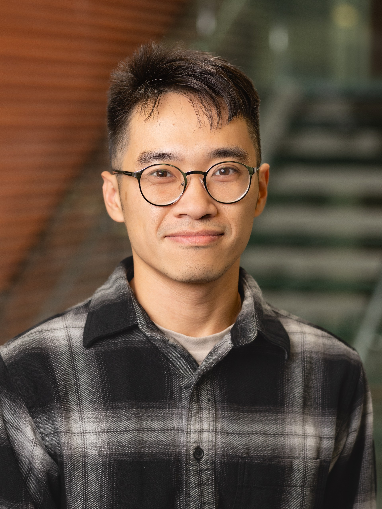
  
    Moses Chan
    Assistant Professor of Instruction, IEMS, Northwestern University
  
</a>

<a class="mentor-tile super" href="#shengbin-ye-profile">
  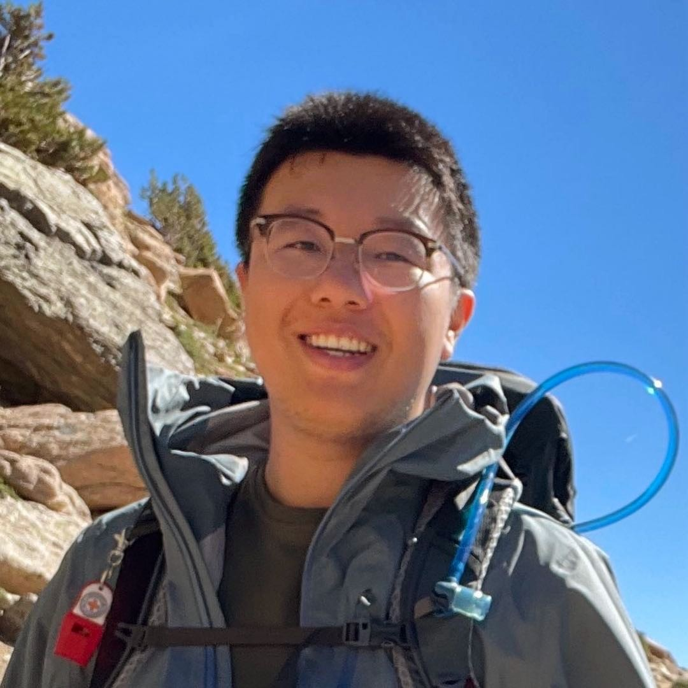
  
    Shengbin Ye
    Assistant Professor of Instruction, Statistics and Data Science, Northwestern University
  
</a>

<a class="mentor-tile super" href="#shreeya-behera-profile">
  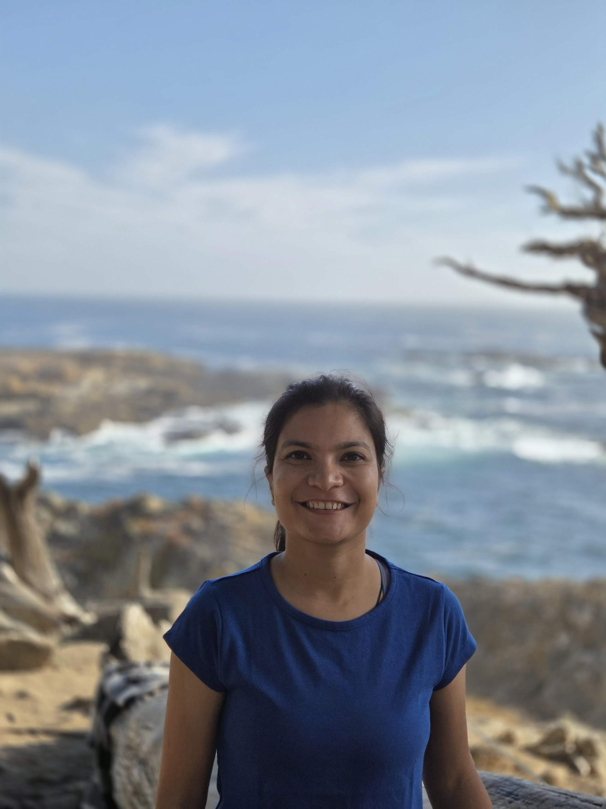
  
    Shreeya Behera
    Assistant Professor of Instruction, Statistics and Data Science, Northwestern University
  
</a>

<a class="mentor-tile super" href="#karthik-prabhu-profile">
  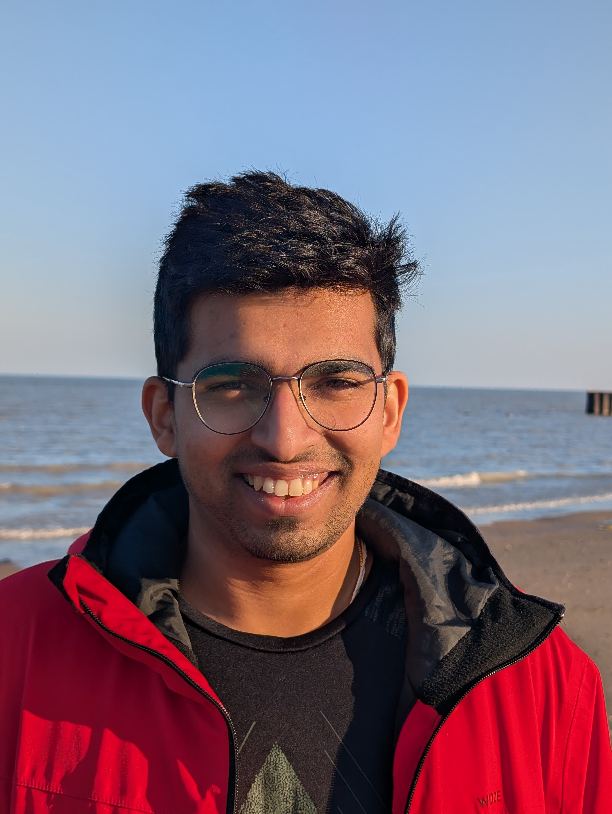
  
    Karthik Prabhu
    Associate, Fraud analytics at Avant
  
</a>

## Mentors

<a class="mentor-tile" href="#harvey-wang-profile">
  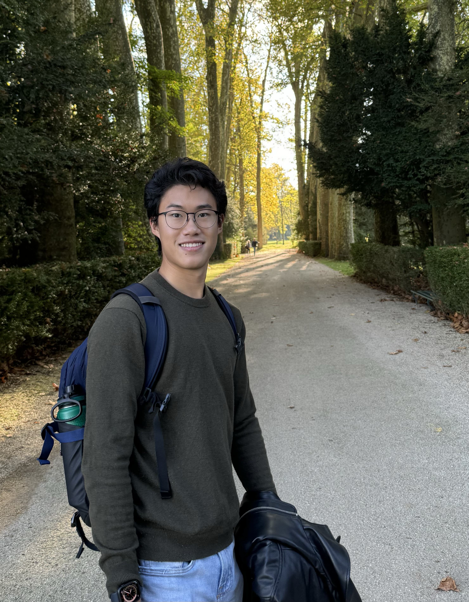
  
    Harvey Wang
    Corporate Strategy and Development Analyst, Molex
  
</a>

<a class="mentor-tile" href="#jeffrey-yuan-profile">
  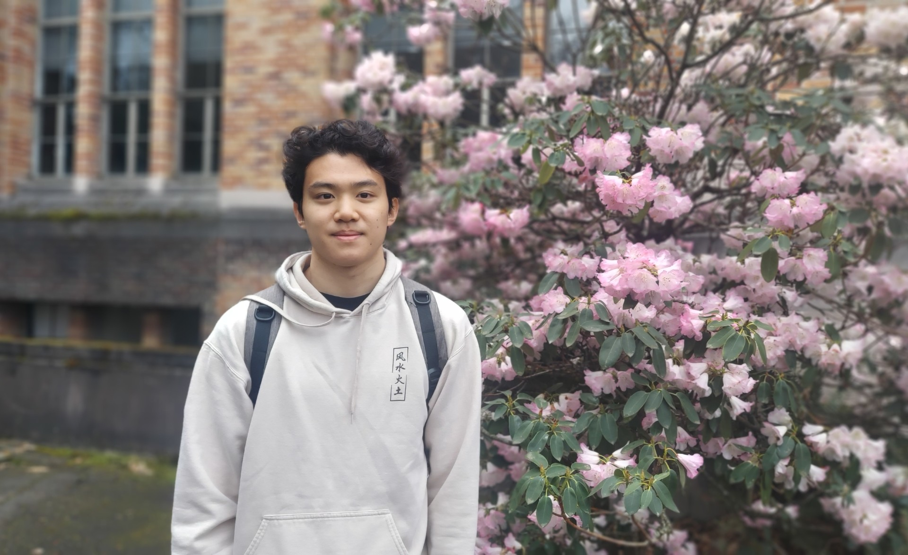
  
    Jeffrey Yuan
    Fourth-year BS/MS Student, Statistics and Data Science, Northwestern University
  
</a>

<a class="mentor-tile" href="#jake-miller-profile">
  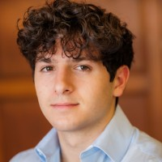
  
    Jake Miller
    Data Science Senior, Northwestern University
  
</a>

<a class="mentor-tile" href="#kyle-williams-profile">
  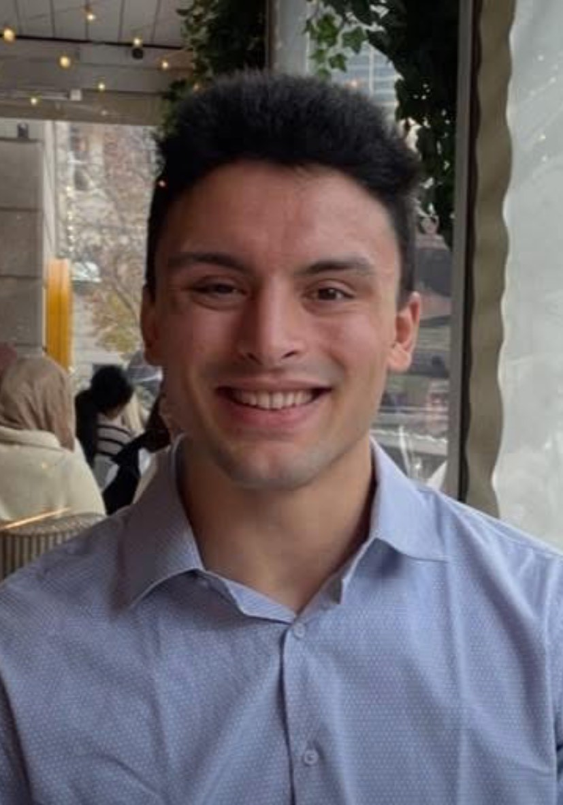
  
    Kyle Williams
    Software Engineer, Lakeview Investment Group
  
</a>

<a class="mentor-tile" href="#harrison-gillespie-profile">
  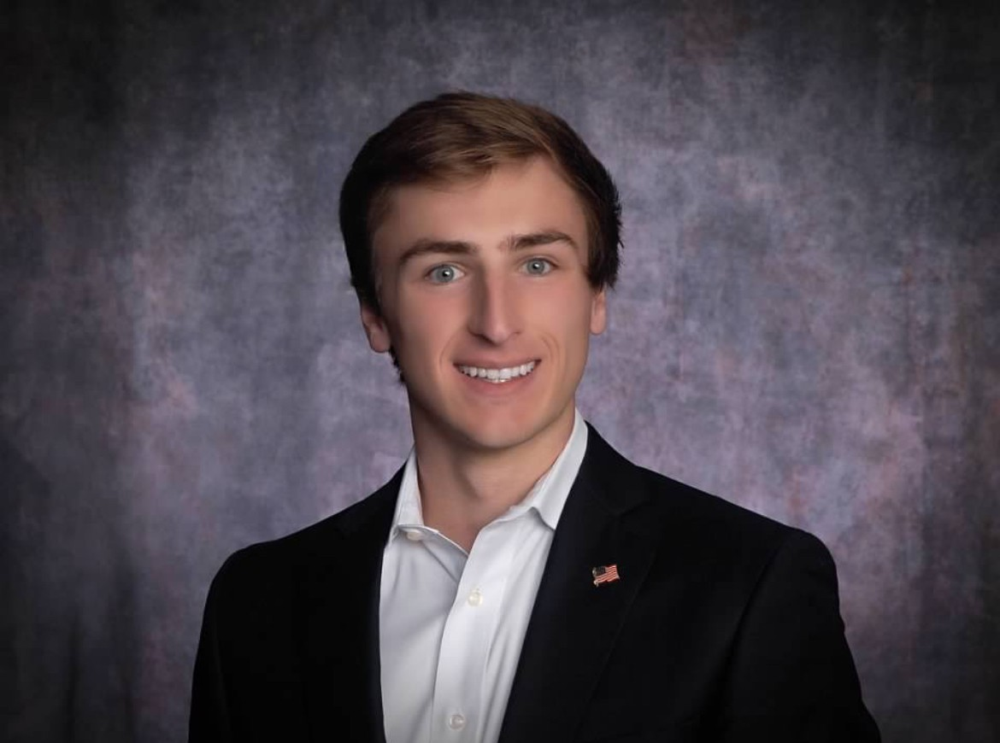
  
    Harrison Gillespie
    MS student, CS, Northwestern University
  
</a>

<a class="mentor-tile" href="#isabel-knight-profile">
  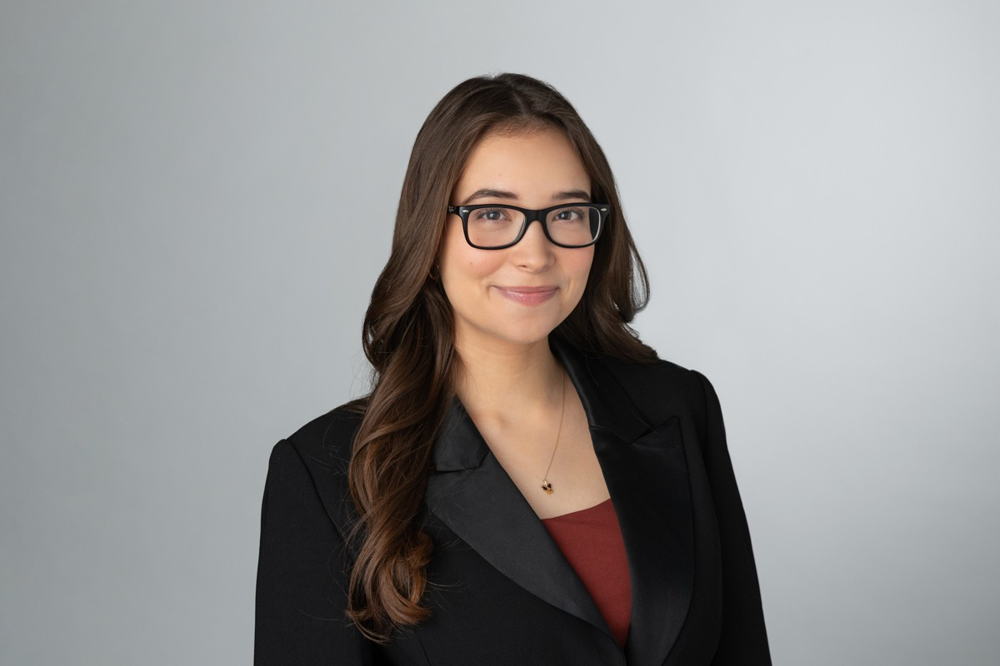
  
    Isabel Knight
    Associate, Forensic Data and Analytics at Ankura
  
</a>

<a class="mentor-tile" href="#aryaman-chawla-profile">
  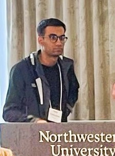
  
    Aryaman Chawla
    MS student, CS, Northwestern University
  
</a>

<a class="mentor-tile" href="#raman-khurana-profile">
  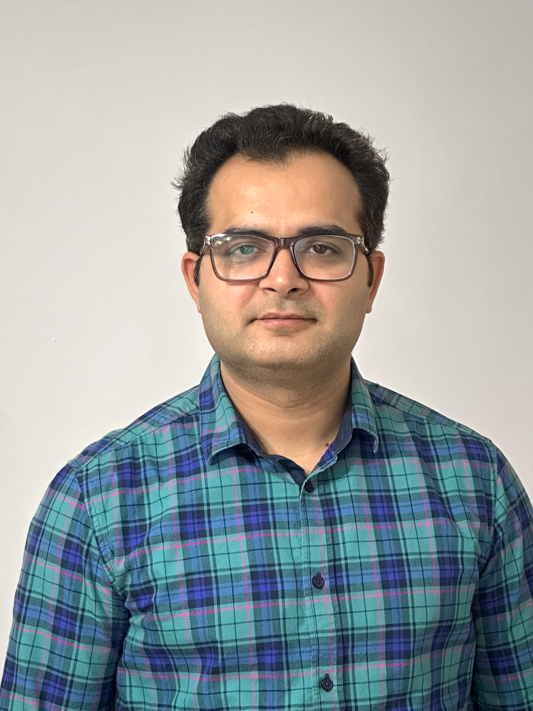
  
    Raman Khurana
    LLM/ML researcher, NU
  
</a>

<a class="mentor-tile" href="#david-gormley-profile">
  
  
    David Gormley
    NLP research student, Stanford
  
</a>

## Full Profiles {.section-gap}

### {#moses-chan-profile .toc-super}

::: {.profile-card .super-mentor}

::: {.profile-topbar}
::: {.profile-topbar-left}
::: {.guest-label}
Super Mentor
:::
:::

[Go back to top ↑](#top){.back-to-top}
:::

::: {.profile-name}
Moses Chan
:::

::: {.profile-photo .right}
{alt="Moses Chan"}
:::

::: {.profile-role}
Assistant Professor of Instruction, IEMS, Northwestern University
:::

Moses co-directs the Minor in Machine Learning & Data Science. His research focuses on developing efficient algorithms at the intersection of statistical theory, computer modeling, and the physical sciences, with particular emphasis on Bayesian computation and data science education in engineering.

Read full profile

He holds a Ph.D. in Industrial Engineering and Management Sciences from Northwestern University. He is the recipient of the 2025/26 Searle Fellowship.

Chan is an active contributor to the NSF CSSI Framework for Bayesian Analysis of Nuclear Dynamics, developing and maintaining the open-source packages surmise and LCGP. In Summer 2025, he collaborated as a Visiting Researcher on projects quantifying parameter importance in numerical physics models at Chalmers University of Technology in Gothenburg, Sweden.

**Mentorship Style:** Chan believes progress matters more than perfection. He works closely with students to build a genuine understanding of their data problems — encouraging them to question assumptions, communicate findings clearly, and think critically at every step. His goal is to make sure students feel supported as they tackle real-world challenges together.

:::

### {#shengbin-ye-profile .toc-super}

::: {.profile-card .super-mentor}

::: {.profile-topbar}
::: {.profile-topbar-left}
::: {.guest-label}
Super Mentor
:::
:::

[Go back to top ↑](#top){.back-to-top}
:::

::: {.profile-name}
Shengbin Ye
:::

::: {.profile-photo .left}
{alt="Shengbin Ye"}
:::

::: {.profile-role}
Assistant Professor of Instruction, Department of Statistics and Data Science, Northwestern University
:::

Shengbin co-instructs the undergraduate data science curriculum and co-advises the MS program in Statistics and Data Science. He is passionate about making complex data easy to understand. His research focuses on symbolic regression—a way of teaching computers to find simple, human-readable math equations that explain patterns in data. By combining statistical theory with efficient algorithms, he helps turn "black box" models into transparent insights that anyone can interpret.

Read full profile

Shengbin holds a Ph.D. in Statistics from Rice University. He joined the Department of Statistics and Data Science in September 2025. His research background includes work on high-dimensional regression and nonparametric variable selection. He is an advocate for open-source software and reproducible research, frequently working with R and Python to solve complex data challenges.

**Mentorship Style:** Shengbin believes in the iterative nature of data science. He encourages students to view model building as a process of continuous refinement rather than a single destination. He is an active listener who helps students think critically about their evidence, guiding them to bridge the gap between complex statistical results and persuasive, high-level narratives.

:::

### {#shreeya-behera-profile .toc-super}

::: {.profile-card .super-mentor}

::: {.profile-topbar}
::: {.profile-topbar-left}
::: {.guest-label}
Super Mentor
:::
:::

[Go back to top ↑](#top){.back-to-top}
:::

::: {.profile-name}
Shreeya Behera
:::

::: {.profile-photo .right}
{alt="Shreeya Behera"}
:::

::: {.profile-role}
Assistant Professor of Instruction, Department of Statistics and Data Science, Northwestern University
:::

Before joining Northwestern, Shreeya was a Data Scientist at Pandora Bio. She is also a passionate educator and deeply interested in using data science to improve education and student mental health.

Read full profile

Shreeya received her PhD in Mathematics and a minor in Computer Science from The Ohio State University in 2024. Her research spans combinatorics, graph theory, and machine learning. At Pandora Bio, she built machine learning models for early detection of stress and anxiety triggers in college students, contributing to work at the intersection of data science, mental health, and education.

**Mentorship Style:** She is a careful listener who takes the time to understand exactly where a student is struggling before offering guidance. She focuses on strengthening fundamentals and explaining concepts in a way that is clear, approachable, and tailored to each student’s level of experience.

:::

### {#karthik-prabhu-profile .toc-super}

::: {.profile-card .super-mentor}

::: {.profile-topbar}
::: {.profile-topbar-left}
::: {.guest-label}
Super Mentor
:::
:::

[Go back to top ↑](#top){.back-to-top}
:::

::: {.profile-name}
Karthik Prabhu
:::

::: {.profile-photo .left}
{alt="Karthik Prabhu"}
:::

::: {.profile-role}
Associate, Fraud analytics at Avant
:::

Karthik currently works as an Associate in fraud analytics at Avant where he is building models for fraud detection and risk assessment. He is a recent PhD graduate in Physics from UC Davis, where his work focused on cosmology, machine learning, and statistical modeling. 

Read full profile

Karthik is an AI enthusiast and enjoys keeping up with breakthroughs in foundational models. He has worked on topics ranging from Bayesian inference, image processing, time-series analysis, anomaly detection, and generative AI.

**Mentorship Style:** Karthik encourages curiosity-driven learning and is passionate about helping others grow in their data science and machine learning journey. He asks questions to help the mentees think through the problems and build confidence in their problem-solving skills.

:::

### {#harvey-wang-profile .toc-super}

::: {.profile-card}

::: {.profile-topbar}
::: {.profile-topbar-left}
::: {.guest-label}
Mentor
:::
:::

[Go back to top ↑](#top){.back-to-top}
:::

::: {.profile-name}
Harvey Wang
:::

::: {.profile-photo .right}
{alt="Harvey Wang"}
:::

::: {.profile-role}
Corporate Strategy and Development Analyst, Molex
:::

Harvey is a recent graduate of Northwestern with majors in Data Science and Economics and a minor in Comparative Literature. He builds internal data tools and designs go-to-market strategies for AI-driven data center infrastructure.

Read full profile

He has also participated in a Northwestern ML research team where he trained neural networks to classify ocular cancer. Additionally, Harvey has worked with Chicagoland nonprofits to manage large-scale donor data and identify high-impact retention tactics. He is experienced in data structures, statistical modeling, and market sizing. Harvey is passionate about discussing ML concepts and helping teams bridge the gap between technical analysis and executive-level strategy.

**Mentorship Style:** Harvey is creative, communicative, and evidence-driven, focusing on impactful modeling and clear data storytelling. He is an active listener who enjoys helping teams translate complex outputs into persuasive, high-level narratives that drive decision-making.

:::

### {#jeffrey-yuan-profile .toc-super}

::: {.profile-card}

::: {.profile-topbar}
::: {.profile-topbar-left}
::: {.guest-label}
Mentor
:::
:::

[Go back to top ↑](#top){.back-to-top}
:::

::: {.profile-name}
Jeffrey Yuan
:::

::: {.profile-photo .left}
{alt="Jeffrey Yuan"}
:::

::: {.profile-role}
Fourth-year BS/MS Student in Statistics and Data Science, Northwestern University
:::

Jeffrey is passionate about data science, machine learning, and AI, and currently works as a Data Scientist at CME Group. His work has explored topics such as graph neural networks, recommendation systems, LLM chain-of-thought reasoning, and agentic AI tools for complex data workflows.

Read full profile

On campus, Jeffrey’s research focuses on applying statistical and machine learning methods to problems in drug discovery and medical AI, including improving reasoning and counterfactual analysis in large language models. He also enjoys teaching and mentoring students in statistics and data science and has served as a teaching assistant for Northwestern’s Data Science sequence and Advanced Machine Learning courses. Outside of data science, he enjoys playing basketball, swimming, and exploring new food spots around Chicago.

**Mentorship Style:** At DataFest, Jeffrey is excited to collaborate with different teams, dive into new datasets, and uncover the interesting stories hidden in data.

:::

### {#jake-miller-profile .toc-super}

::: {.profile-card}

::: {.profile-topbar}
::: {.profile-topbar-left}
::: {.guest-label}
Mentor
:::
:::

[Go back to top ↑](#top){.back-to-top}
:::

::: {.profile-name}
Jake Miller
:::

::: {.profile-photo .right}
{alt="Jake Miller"}
:::

::: {.profile-role}
Data Science Senior, Northwestern University
:::

Throughout his college career, Jake has taken many classes in the Statistics department and has especially enjoyed his coursework in machine learning techniques.

Read full profile

Some projects he has worked on include building and quantizing a CNN model to create a lightweight word detection model and building a dashboard to help break down call data for a non-profit law firm. Though he started full-time work in September, he is currently working on a personal project to build an NBA salary cap manager application.

**Mentorship Style:** As a mentor, Jake hopes to be a great sounding board for his mentees to bounce ideas off of. Jake also loves to talk more about his school and career path to give insights in any way and place that he can.

:::

### {#kyle-williams-profile .toc-super}

::: {.profile-card}

::: {.profile-topbar}
::: {.profile-topbar-left}
::: {.guest-label}
Mentor
:::
:::

[Go back to top ↑](#top){.back-to-top}
:::

::: {.profile-name}
Kyle Williams
:::

::: {.profile-photo .left}
{alt="Kyle Williams"}
:::

::: {.profile-role}
Software Engineer, Lakeview Investment Group
:::

Kyle earned his BS in Computer Science with a Minor in Data Science in June 2023, followed by an MS in Computer Science in June 2024. While he took a majority of his courseload in the CS Department, it is the application of math, statistics, and science through code that is the most interesting to him.

Read full profile

Kyle has always been drawn to Machine Learning and Data Analysis. Being able to understand and communicate about data makes him feel powerful and responsible.

As a part of his master’s, Kyle completed a Thesis on LLMs (Large Language Models), where he augmented the attention mechanism to use Euclidean distance instead of dot-product to improve the performance of small models on OpenBookQA by 14%. Currently, Kyle is helping build high-speed, real-time dashboards and trading systems to display important statistics and execute orders when certain triggers are reached.

**Mentorship Style:** Kyle’s greatest strength as a mentor is his patience. As a triplet, Kyle had to share everything – even a birthday – and it’s made him a great listener, effective mediator and strong communicator. Kyle loves talking about code, and he hopes to be a resource for any student who wants to learn more about what it means to be a Computer Scientist in industry. Outside of tech, Kyle’s also a big fan of wrestling and football—and always happy to connect over either!

:::

### {#harrison-gillespie-profile .toc-super}

::: {.profile-card}

::: {.profile-topbar}
::: {.profile-topbar-left}
::: {.guest-label}
Mentor
:::
:::

[Go back to top ↑](#top){.back-to-top}
:::

::: {.profile-name}
Harrison Gillespie
:::

::: {.profile-photo .right}
{alt="Harrison Gillespie"}
:::

::: {.profile-role}
Master's student, Computer Science, Northwestern University
:::

Harrison is a Master’s student in Computer Science at Northwestern University, where he also earned his B.S. in Computer Science with minors in Data Science & Engineering and Business Institutions. His academic and professional interests center on applied AI and data driven decision making.

Read full profile

During his time at Northwestern, Harrison has gained industry experience through multiple data science and analytics internships. He previously worked as a Technology Analyst at a private equity firm which included a project analyzing ESG data across 10,000+ residential properties to uncover cost inefficiencies and resource usage patterns, ultimately informing a proposal for more sustainable and cost effective management strategies. He also served as an Analytics Intern at Caterpillar, where his work included projects that leveraged agentic AI to collect, synthesize, and identify trends in machine health metrics and other customer data. Following graduation, Harrison will join Caterpillar full-time as a Data Scientist within their Data & AI group. In addition to his professional work, he was part of the team that earned the People’s Choice Award and Honorable Mention at last year’s DataFest.

**Mentorship Style:** Harrison approaches mentorship with a strong emphasis on adaptability, learning, and team centered support. He focuses on meeting teams where they are, whether that means helping clarify problem direction or providing structure during the high intensity moments. He aims to be a calm, steady presence when teams feel stuck, helping them regain momentum through thoughtful guidance rather than prescriptive solutions. Harrison is also happy to share insights on his experience with recruiting and working in the data science field.

:::

### {#isabel-knight-profile .toc-super}

::: {.profile-card}

::: {.profile-topbar}
::: {.profile-topbar-left}
::: {.guest-label}
Mentor
:::
:::

[Go back to top ↑](#top){.back-to-top}
:::

::: {.profile-name}
Isabel Knight
:::

::: {.profile-photo .left}
{alt="Isabel Knight"}
:::

::: {.profile-role}
Associate, Forensic Data and Analytics at Ankura 
:::

Isabel is a recent graduate of Northwestern University, where she earned a degree in Data Science with minors in Spanish and Legal Studies. She is interested in the intersection of technology and law. At Ankura, her work focuses on data-driven investigations, including investment fraud, as well as supporting litigation and trial strategy through data analysis.

Read full profile

During her time at Northwestern, Isabel served as a teaching assistant for two years in the Department of Statistics and Data Science, primarily supporting coursework in the STAT 303 sequence and STAT 302. Isabel also gained industry experience through two summers interning at Toyota within the HR People Analytics team. There, she applied her data science skill set to a variety of impactful projects, including developing an attrition model in Python to predict employee turnover. Currently, Isabel applies her experience to clean, analyze, and visualize large, complex datasets in support of client-facing investigations and litigation matters. Her work often involves transforming unstructured or messy data into clear, actionable insights. Outside of work, Isabel enjoys spending time with her family and keeping up with reality TV, especially Survivor and The Traitors!

**Mentorship Style:** Isabel approaches mentorship with a strong emphasis on collaboration, curiosity, and inclusivity. The best ideas come from open dialogue and values creating an environment where every team member feels comfortable sharing their thoughts, regardless of experience level. Drawing from her background as both a teaching assistant and young professional, she enjoys helping others connect foundational concepts to real-world applications, making complex problems feel more approachable. As a mentor, she aims to foster a team dynamic where individuals feel empowered to contribute meaningfully and support one another.

:::

### {#aryaman-chawla-profile .toc-super}

::: {.profile-card}

::: {.profile-topbar}
::: {.profile-topbar-left}
::: {.guest-label}
Mentor
:::
:::

[Go back to top ↑](#top){.back-to-top}
:::

::: {.profile-name}
Aryaman Chawla
:::

::: {.profile-photo .right}
{alt="Aryaman Chawla"}
:::

::: {.profile-role}
Masters student, CS, Northwestern University
:::

Aryaman has a background across a variety of domains such as quantum computing, cryptography, symbolic AI and ML/DL. 

Read full profile

He was the first runner-up in Datafest 2025, and is excited to share his experience.

**Mentorship Style:** His focus is on helping teams break down complex problems to build practical solutions, and communicate results clearly.

:::

### {#raman-khurana-profile .toc-super}

::: {.profile-card}

::: {.profile-topbar}
::: {.profile-topbar-left}
::: {.guest-label}
Mentor
:::
:::

[Go back to top ↑](#top){.back-to-top}
:::

::: {.profile-name}
Raman Khurana
:::

::: {.profile-photo .left}
{alt="Raman Khurana"}
:::

::: {.profile-role}
LLM/ML Researcher and Lecturer, Northwestern University
:::

Raman is a Postdoctoral Researcher at the Center for Deep Learning and a Lecturer in the MS in Machine Learning & Data Science program at Northwestern University.

Read full profile

With a PhD in Physics and over 15 years of experience working with large-scale data, he brings a unique blend of scientific rigor and AI innovation to his work. At CERN, he contributed to the Nobel Prize-winning discovery of the Higgs boson. His current research focuses on time series forecasting, automated feature engineering for streaming data, and generative AI

Raman builds agentic AI systems using open-source small- and medium-sized models and explores methods to apply them to real-world business problems. Drawing on his physics background, he developed a physics-inspired feature generator that models time series data as a flowing river. He finds joy in exploring numbers and algorithms but finds it even more rewarding to share those experiences with fellow data scientists in industry and the next generation of data professionals in the MS in Machine Learning & Data Science program. For Raman, the true excitement lies not just in solving complex problems, but in making those insights accessible, collaborative, and impactful.

:::

### {#david-gormley-profile .toc-super}

::: {.profile-card}

::: {.profile-topbar}
::: {.profile-topbar-left}
::: {.guest-label}
Mentor
:::
:::

[Go back to top ↑](#top){.back-to-top}
:::

::: {.profile-name}
David Gormley
:::

::: {.profile-photo .right}
{alt="David Gormley"}
:::

::: {.profile-role}
NLP research associate, Stanford
:::

David is an education-NLP research associate under Professors Loeb and Demszky at Stanford GSE. H

Read full profile

He is interested in co-designing NLP-based education tools with students, educators, and researchers to support young learners. As a data scientist, David specializes in scaled NLP, though he also has experience with computer vision and exploring novel ML modeling approaches.

**Mentorship Style:** His mentorship style is rooted in pedagogy: he aims to create a student-centered environment where students feel empowered to use data science to tackle problems they care about.

:::
