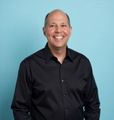

Below are the keynote speaker(s), judges, and panelists confirmed for DataFest 2026. These distinguished guests will guide discussions, provide industry insights, and evaluate team presentations throughout the event.

*We'll keep updating this page as we finalize the guests for the event.*

---

## Keynote Speaker

::: {.guest-grid}
::: {.guest-photo}
{alt="Kaveh Safavi"}
:::

::: {.guest-bio}
### Kaveh Safavi  
***Senior Executive Advisor / Investor / Educator***  
[**(Keynote speaker)**]{style="color:#4E2A84;"}

Kaveh Safavi is a healthcare strategist with extensive experience in digital health, growth strategy, and international expansion. He is a **Partner at Guidon Partners**, a firm that advises and co-invests in healthcare services companies, and a **Health Senior Advisor at Accenture**. He is also an **Adjunct Lecturer in Health Enterprise Management at the Kellogg School of Management (Northwestern University)**.

He recently retired as a Senior Managing Director at Accenture for Global Health, where he helped providers, health insurers, and public health systems across the Americas, Europe, and Asia Pacific harness the promise of technology and human ingenuity. Prior to Accenture, he held leadership roles at Cisco, Thomson Reuters, UnitedHealthcare, and Alexian Brothers Health System.

Dr. Safavi has published numerous papers and is frequently quoted on healthcare issues in major outlets, including *The Wall Street Journal*, the BBC, *The New York Times*, *Consumer Reports*, *U.S. News & World Report*, *Harvard Business Review*, and *The Economist*.
:::

::: {.guest-facts}
**Quick facts**

- **Current roles:** Partner, Guidon Partners; Health Senior Advisor, Accenture  
- **Academic:** Adjunct Lecturer, Kellogg School of Management (Northwestern)  
- **Notable:** Established one of the **Midwest’s first EHR-enabled** primary care practices  
- **Recognition:** *The IT Services Report* — **Top 5 Healthcare IT Executives** (2020, 2025)  
- **Education:** M.D. (Loyola), J.D. (DePaul)  
- **Boards:** Weinberg College Board of Visitors; Easterseals National Board  
- **Hometown:** Chicago
:::
:::

---

```{=html}
<style>
/* Guest two-column layout */
.guest-grid{
  display:grid;
  grid-template-columns: 220px 1.4fr 0.9fr;
  gap: 20px;
  align-items:start;
  margin-top: 0.75rem;
  margin-bottom: 1.25rem;
}

.guest-photo img{
  width: 100%;
  height: auto;
  border-radius: 10px;
}

/* Right-column “card” look */
.guest-facts{
  border: 1px solid rgba(0,0,0,0.12);
  border-radius: 12px;
  padding: 14px 16px;
  background: rgba(0,0,0,0.02);
}

.guest-facts p{
  margin-top: 0.25rem;
}

.guest-bio h3{
  margin-bottom: 0.25rem;
}

/* Responsive: stack on small screens */
@media (max-width: 900px){
  .guest-grid{
    grid-template-columns: 1fr;
  }
  .guest-photo{
    max-width: 260px;
  }
}
</style>
