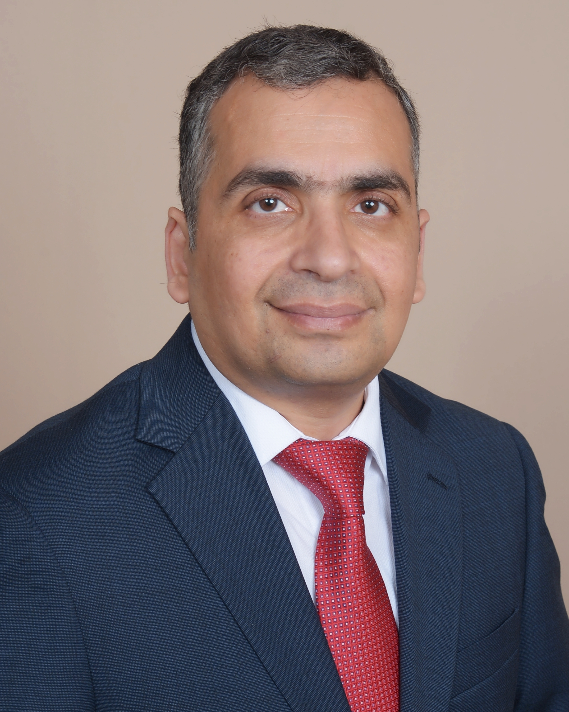
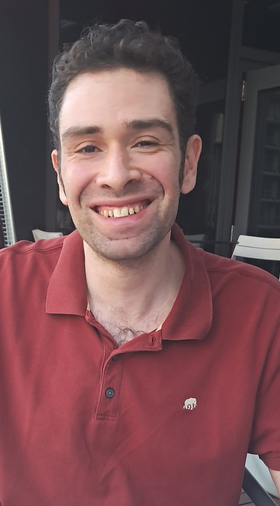
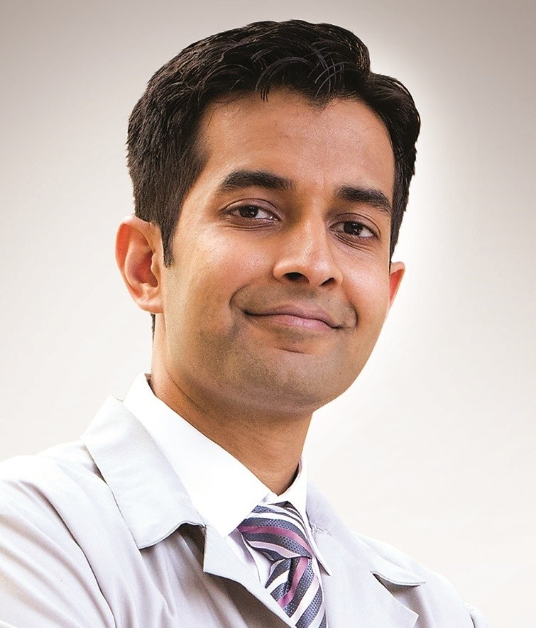
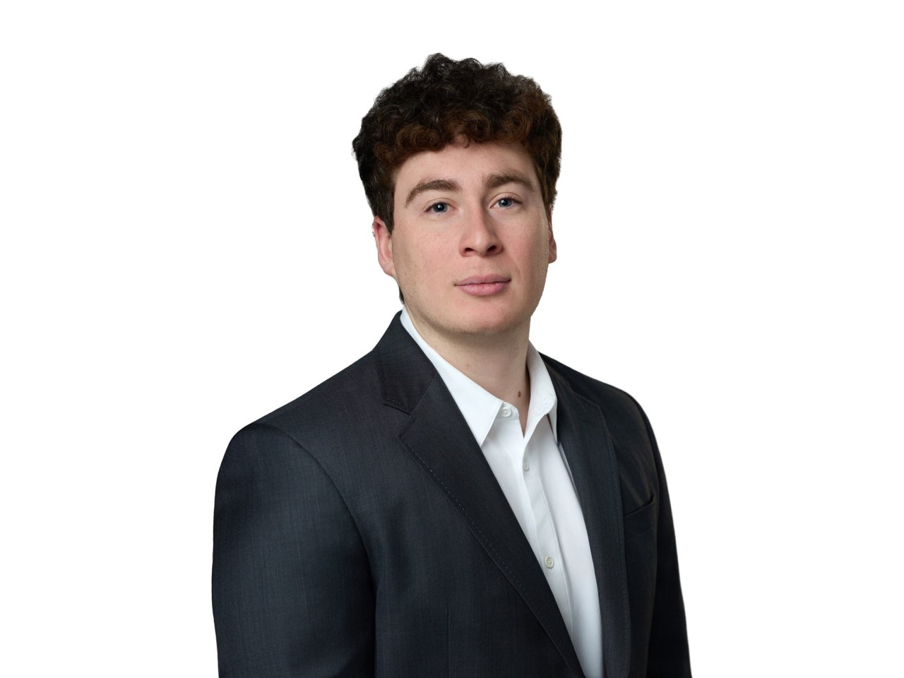
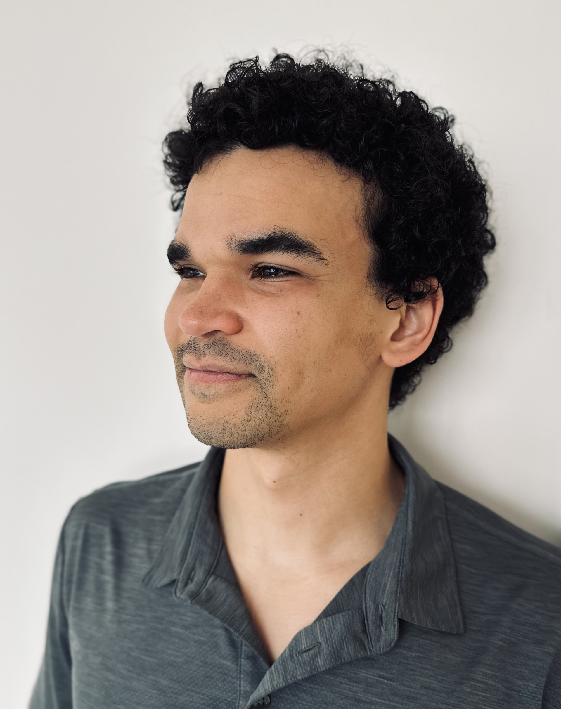

Below are the keynote speakers, judges, and panelists confirmed for DataFest 2026. These distinguished guests will share industry insights and guide discussions on *Careers in Data Science*.

*This page will be updated as additional guests are confirmed.*

::: {.guest-card}
::: {.guest-photo}
{alt="Kaveh Safavi"}
:::

Fireside Chat

## Kaveh Safavi

Senior Executive Advisor, Investor, and Educator

Kaveh Safavi is a healthcare strategist with extensive experience in digital health, growth strategy, and international expansion. He is a **Partner at Guidon Partners**, a firm that advises and co-invests in healthcare services companies, and a **Health Senior Advisor at Accenture**.

Read more

Dr. Safavi recently retired as a Senior Managing Director at Accenture for Global Health, where he helped providers, health insurers, and public health systems across the Americas, Europe, and Asia Pacific harness technology and human ingenuity. Prior to Accenture, he held leadership roles at Cisco, Thomson Reuters, UnitedHealthcare, and Alexian Brothers Health System.

Highlights of his career include:

- Establishing one of the **Midwest’s first electronic-health-record-enabled primary care practices**
- Being named by *The IT Services Report* among the **top 5 healthcare IT executives** in 2020 and 2025

Dr. Safavi has published widely and is frequently quoted on healthcare issues in major outlets, including *The Wall Street Journal*, the BBC, *The New York Times*, *Consumer Reports*, *U.S. News & World Report*, *Harvard Business Review*, and *The Economist*.

He earned his M.D. from Loyola University Chicago Stritch School of Medicine and his J.D. from DePaul University College of Law. He is board-certified in internal medicine and pediatrics and completed his residency at the University of Michigan Medical Center. He also serves on the Weinberg College of Arts and Sciences Board of Visitors at Northwestern University and is a member of the Easterseals National Board of Directors.

Dr. Safavi is a lifelong Chicagoan.

:::

::: {.guest-card .left}
::: {.guest-photo}
{alt="Nishant Nayar"}
:::

Panelist

## Nishant Nayar

Lead Solutions Analyst and Technical Program Manager, JPMorganChase

Nishant Nayar has spent over two decades at the intersection of data, technology, and business, working across investment banking, commercial banking, and asset management. He specializes in translating complex data into practical insights for decision-makers.

Read more

His expertise spans data science, analytics, explainable AI, and generative AI. He holds a Master’s degree in Analytics from the University of Chicago and an MBA in Finance from Punjabi University, a combination that enables him to bridge technical and business perspectives effectively.

:::

::: {.guest-card}
::: {.guest-photo}
{alt="Igor Uzilevskiy"}
:::

Panelist

## Igor Uzilevskiy

Principal Data Scientist at VideoAmp

Igor works in ad tech. He works primarily on the company's media planning product, which uses a predictive model to forecast how a given allocation of ad dollars across different media properties will translate into unique reach, and then a mixed integer program to solve for an optimal buy. 

Read more

He previously worked at Nielsen, where in his most recent role he researched updates to Nielsen's sample weighting algorithm as the company moved from a statistically selected sample to a hybrid of a statistically selected sample and a large convenience sample for measuring TV viewing. 

Igor holds a BA in Economics and a MS in Machine Learning and Data Science from Northwestern.

:::

::: {.guest-card .left}
::: {.guest-photo}
{alt="Nirav Shah"}
:::

Panelist

## Nirav Shah

Associate Chief Medical Informatics Officer, AI and Innovation; Director of Investigational Innovation, Endeavor Health

Nirav Shah, MD, MPH is a practicing infectious disease physician and an AI leader at Endeavor Health, where he drives the strategic development and responsible implementation of AI and digital solutions in clinical practice.

Read more

He also serves as the Director of Investigational Innovation and runs a clinical trials group with a focus on early stage AI and digital solutions. He has received internal and external grants and has reviewed grant proposals for national funding agencies.

He is an experienced speaker at national conferences and has published widely in reputable journals including NEJM, JAMA, JAMIA, and CID. He is an assistant clinical professor at the University of Chicago Pritzker School of Medicine and completed a significant portion of his education and training at Northwestern (BA 2004, MD 2008, MPH 2008, internal medicine residency 2011). He is committed to mentoring the next generation of healthcare professionals and has participated in programs to mentor Northwestern college students.

:::

::: {.guest-card}
::: {.guest-photo}
{alt="Monica Mittal"}
:::

Panelist

## Monica Mittal

Senior Data Scientist in Applied AI and ML, JPMorganChase

Dr. Monika Mittal has a PhD in Physics and over 15 years of experience working with large-scale scientific and enterprise data. She spent more than a decade as a Postdoctoral Researcher at CERN, where she contributed to advanced particle physics research associated with the Nobel Prize–winning discovery of the Higgs boson.

Read more

At CERN, her work focused on extracting insights from massive experimental datasets using advanced statistical and computational techniques for the precise measurement of Vector Boson Fusion at CMS and ATLAS experiment. She also led development efforts at the detector edge.

Transitioning from fundamental science to industry, Monika now applies her expertise in machine learning, predictive modeling, and data-driven decision systems to solve complex business problems. She specializes in working with regulatory and compliance-related data, leveraging large language models (LLMs), agentic AI, and RAG systems to automate analysis, extract knowledge from complex documents, and support intelligent decision-making. Monika is passionate about building scalable AI solutions that bridge scientific methodology with real-world business needs, transforming complex data into actionable insights and impactful applications.

:::

::: {.guest-card .left}
::: {.guest-photo}
{alt="Zachary Fox"}
:::

Panelist

## Zachary Fox

Senior Analyst at Analysis Group

Zach Fox is a Senior Analyst at Analysis Group in Chicago, where he applies economic theory and data science methods to solve complex business disputes.

Read more

Zach has worked on cases spanning finance, technology, tax, commercial disputes, and valuation, using tools like Python, R, Stata, SAS, and Excel to turn messy data into clear stories. A proud Northwestern alum, Zach majored in Economics and Communication Studies with minors in Business Institutions and Data Science. He’s excited to be back for DataFest and is especially looking forward to seeing creative thinking, strong teamwork, and clean data.

:::

::: {.guest-card}
::: {.guest-photo}
{alt="Philip Cooper"}
:::

Panelist

## Phil Cooper

Senior Analytics Engineer, Alchemyca Biotech

Phil is currently building a predictive analytics solution for renewable natural gas facilities. This involves bringing together sensor data, lab test results, and economic indicators in a single platform to forecast and optimize production.

Read more

Phil has previously worked in logistics tech, where he ran pricing experiments and developed explainability tools for machine learning models. He also worked at an equipment manufacturing company, where he helped to modernize their reporting processes and gain insight into product usage with telematics data.

He holds a BA in Economics from Northwestern and an MS in Applied Data Science from the University of Chicago.

:::