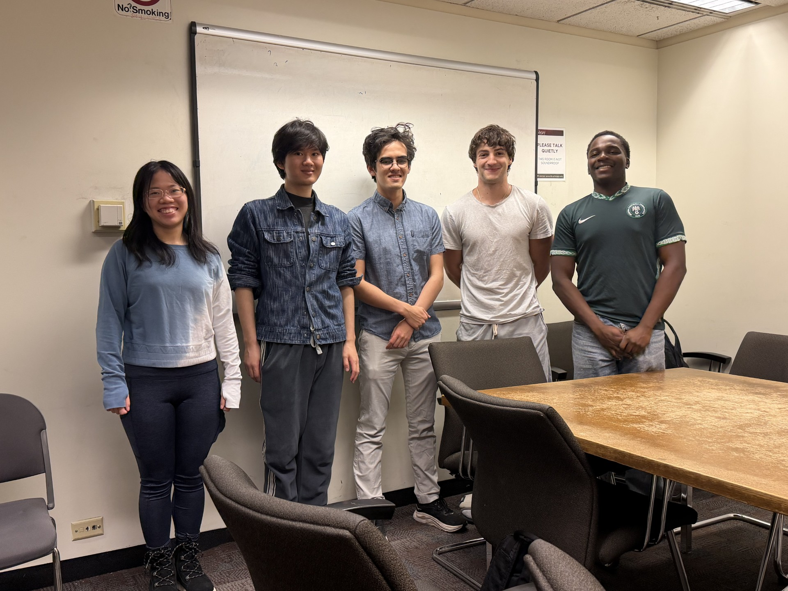

**21 powerhouse teams, 84 brilliant minds**, clash in the ultimate data-analytics showdown

## 1. As written {style="color:#4E2A84;"}
*(Robert, Ice-T, Owen & Swas)*

*Tagline*

**Mentor:** Raman Khurana & Shreeya Behera

{width=80%}

## 2. Block{style="color:#4E2A84;"}
*(Kenneth, Lucas & Braedon)*

*Tagline*

**Mentor:** Aryaman Chawla & Moses Chan

{width=80%}

## 3. Byte me{style="color:#4E2A84;"}
*(Fiona, Ashley, Zara, Samuel, & Benjamin)*

*Tagline*

**Mentor:** Isabel Knight & Karthik Prabhu

{width=80%}

## 4. Data Hunters{style="color:#4E2A84;"}
*(MinJun, Jonathan, Adi, Martin & Tendai)*

*Tagline*

**Mentor:** David Gormley & Shreeya Behera

{width=80%}

## 5. Goldfish{style="color:#4E2A84;"}

*(Yubin, Ian, Merina, Sonja & Jules)*

*Tagline*

**Mentor:** UChicago mentor

{width=80%}

## 6. Hello{style="color:#4E2A84;"}
*(Daniel, Camden, Aileen & Charles)*

*Tagline*

**Mentor:** Jeffrey Yuan & Shengbin Ye

{width=80%}

## 7. hey come and drink tea{style="color:#4E2A84;"}
*(Vincent, Sarah, Gustavo, Andres & Annie)*

*Tagline*

**Mentor:** Kyle Williams & Moses Chan

{width=80%}

## 8. Lakeside Data Center{style="color:#4E2A84;"}
*(Gabriel, Alina, Matthew, & Emmanuel)*

*Seeking truth in the mess*

**Mentor:** Jeffrey Yuan & Moses Chan

{width=80%}

## 9. Leftovers{style="color:#4E2A84;"}
*(Vedat, Defne & Efe)*

*Tagline*

**Mentor:** UChicago mentor

{width=80%}

## 10. Livin la vida loca{style="color:#4E2A84;"}
*(Sofie, Ethan, Edwin & Edwin)*

*Tagline*

**Mentor:** Kyle Williams & Moses Chan

{width=80%}

## 11. Lunar Knights{style="color:#4E2A84;"}
*(Kevin, Vincent, John & Zoya)*

*Tagline*

**Mentor:** Harvey Wang & Karthik Prabhu

{width=80%}

## 12. New Team 1{style="color:#4E2A84;"}
*(Saafya, Yana & Adonai)*

*Tagline*

**Mentor:** Aryaman Chawla & Shengbin Ye

{width=80%}

## 13. Human{style="color:#4E2A84;"}
*(Sara, Caesar, Aidan & Dayo)*

*Very fleshy*

**Mentor:** UChicago mentor

{width=80%}

## 14. NorthBestern{style="color:#4E2A84;"}
*(Owen & Emmett)*

*Tagline*

**Mentor:** Harvey Wang & Shengbin Ye

{width=80%}

## 15. Outliars{style="color:#4E2A84;"}
*(Uma, Kaylee, Edgar & Ell)*

*Tagline*

**Mentor:** UChicago mentor

{width=80%}

## 16. Penguin{style="color:#4E2A84;"}
*(Oliver, Alan, Dawson & Jeremy)*

*Tagline*

**Mentor:** Jake Miller & Karthik Prabhu

{width=80%}

## 17. Standard Deviants{style="color:#4E2A84;"}
*(Will, Ryan, Matias & Adithya)*

*100% confidence interval*

**Mentor:** David Gormley & Shreeya Behera

{width=80%}

## 18. Stay Saavy{style="color:#4E2A84;"}
*(Diane, Eva, Vivian & Inaaya)*

*Tagline*

**Mentor:** Jake Miller & Shreeya Behera

{width=80%}

## 19. The Monsters{style="color:#4E2A84;"}
*(Joonsung, Colin, Jet & Dylan)*

*3 Beasts, 1 Monster*

**Mentor:** Sutter Augur & Karthik Prabhu

{width=80%}

## 20. The Perfect Fit{style="color:#4E2A84;"}
*(Sophia, Hannah, Kay, Takeshi & Selina)*

*Tagline*

**Mentor:** Isabel Knight & Shengbin Ye

{width=80%}

## 21. The Winning Team{style="color:#4E2A84;"}
*(Vikas, Marina, Julie, Johnny, & Belinda)*

*Tagline*

**Mentor:** Harrison Gillespie & Shengbin Ye

{width=80%}