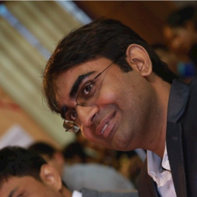
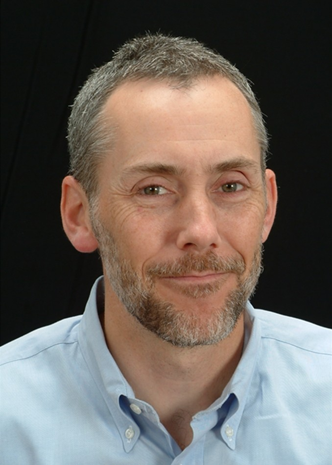

We are excited to host the following sessions on **Friday, April 17** in the Louis Room at Norris (1999 Campus Dr, Evanston, IL 60208), as part of the pre-DataFest event:

------------------------------------------------------------------------

## 1. Data Analytics Competition Strategy (2:00 PM – 3:00 PM)

- How to approach a **48-hour competition effectively**
- Quick data quality checks before deep-dive
- Structuring teamwork and task delegation  
- Balancing:
  - Exploration vs. execution  
  - Modeling vs. storytelling  
- Tips from prior DataFest experience  

*Snacks and beverages will be served during the event*

------------------------------------------------------------------------

## 2. AI Seminar (3:00 PM – 4:30 PM)

**Topic:** *First Ever Sovereign Livelihood AI Model in the World*

### Speakers

::::: columns
::: {.column width="30%" style="padding-right: 12px;"}
{fig-alt="Ashwin Srivastava" width="100%" style="border-radius:12px;"}
:::

::: {.column width="70%" style="padding-left: 12px;"}
**Ashwin Srivastava** is a [**Forbes Asia 30 Under 30 honouree**](https://www.forbes.com/30-under-30-asia/2017/finance-venture-capital/#59d22d221193) with experience in global investments and impact-focused serial entrepreneurship. He has also been recognized among the top 1% of growth-stage entrepreneurs in the world by Webit, and his innovations have been featured in *Paradigm Shift* by Microsoft India.

- **Mode of participation:** Ashwin will **join virtually**

:::

- **Affiliation:** Ashwin represents the **Government of Maharashtra, India**, particularly the **Office of District Collector, Mumbai Suburban**

::::: columns
::: {.column width="30%" style="padding-right: 12px;"}
{fig-alt="Rick Rummler" width="80%" style="border-radius:12px;"}
:::

::: {.column width="70%" style="padding-left: 12px;"}
- **Rick Rummler** is the Performance Architect at CodecaX, a partner supporting the Saksham Skill Census, an initiative by the Government of Maharashtra (India) and Sapio Analytics. Rick and CodecaX are working with Sapio Analytics on developing the complex livelihood and skilling frameworks that define Livelihood Intelligence. Rick has led process and performance design and improvement initiatives at leading global organisations, while working with consulting groups worldwide on public health, microfinance and international development needs.
:::

- **In-person presentation:** Rick will join **in-person**.

:::::

------------------------------------------------------------------------

### Abstract

We’ve all heard of *Legal AI*, *Health AI*, and other sector-specific AI models. But what if AI could help solve unemployment at scale?

India is leading this effort through a **Sovereign Livelihood AI Model**—an innovative, AI-driven framework designed to transform employment, skilling, and livelihoods in developing economies by reshaping how governments make decisions.

Read more

Starting with the **Mumbai Suburban District**, through Shri Saurabh Kariyar, Honorable District Collector, and visionary guidance of Honorable Guardian Minister of the district, Shri Ashish Shelar, India is pioneering an **AI-powered Skill Census** to address some of the most complex societal challenges.

This AI model is designed to understand the **hyper-diverse, rapidly changing socio-economic landscape** of a city like Mumbai, where neighborhoods can change drastically within just a few hundred meters.

Some of the challenges include:

- Areas and bylanes not covered by Google Maps  
- Cultural nuances that even today’s major foundation models (GPT, Claude or Gemini) can't capture  
- Communities not adequately understood by government systems  
- Youth whose voices are often unheard by institutions that influence livelihoods, including businesses, governments, and academia  

This seminar will offer a glimpse into how Mumbai is addressing these challenges by conducting a complex census with foundational AI at its center.

It will also introduce a broader way of thinking about AI—one grounded in data, human realities, and public decision-making—while showing its real impact on the ground.

---

### What to Expect (Takeaways)

- **AI Reinvented**
  - Learn about foundational AI models that go beyond familiar approaches
  - Understand how humans are at the center of building AI for humans
  - Think more broadly about how foundational models can be designed

- **Real-World Impact**
  - See how AI is helping guide decisions related to:
    - Skilling
    - Employment
    - Self-employment

- **Broaden Your Perspective**
  - Explore how the developing world is solving complex societal challenges
  - Gain ideas that could reshape how you think about AI, your career, and the future of the field

---

### Why Attend?

- **Unlock New Ideas**
  - This seminar is not just about theory; it focuses on real impact on the ground

- **Access a Government Perspective**
  - Most courses focus on academic or business settings, but governments will play a major role in shaping the future of AI

- **Get Inspired**
  - Be part of a conversation about how AI can redefine livelihoods across the globe

------------------------------------------------------------------------

## 3. How to Use AI Efficiently and Responsibly + Menolearn (4:30 PM – 5:00 PM)

- Setting up AI tools and building an efficient data analysis workflow
- Rules for appropriate AI usage during the DataFest 
- Understanding:
  - When to use AI vs. when not to  
  - Risks of over-reliance  
- Ethical and responsible AI usage in data science workflows  

------------------------------------------------------------------------

## 4. Socials (5:00 PM – 7:00 PM)

- Meet your teammates and connect with other participants
- Interact with the organizers
- Build connections ahead of the competition
- Team photo session
- We are finalizing the logistics and will share updates about snacks during the socials soon

*Snacks will be served during the event*
