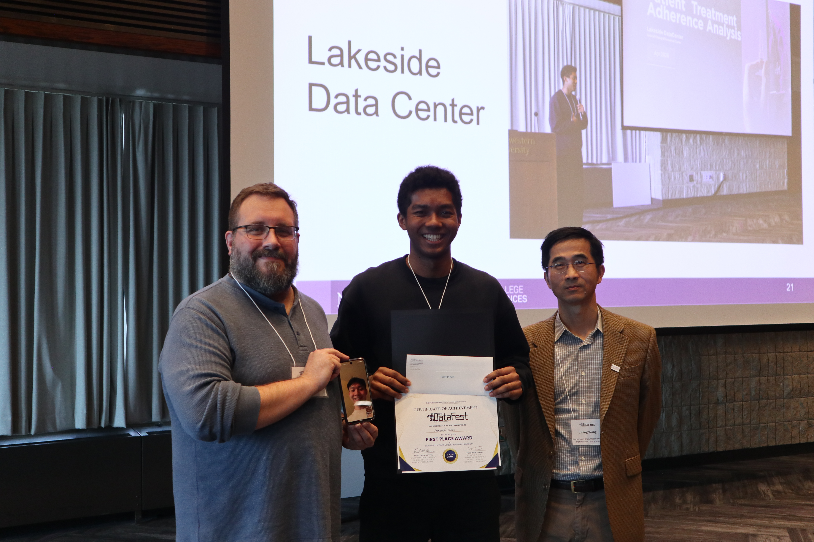
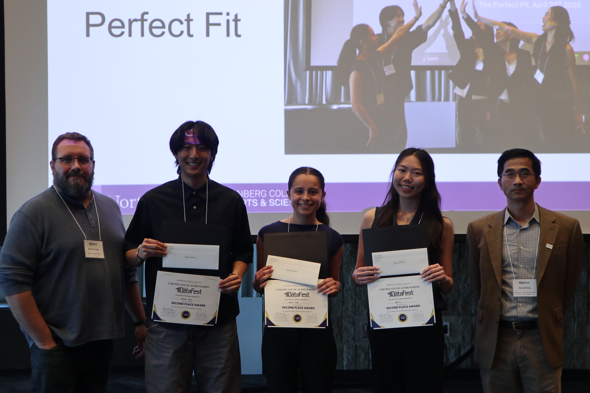
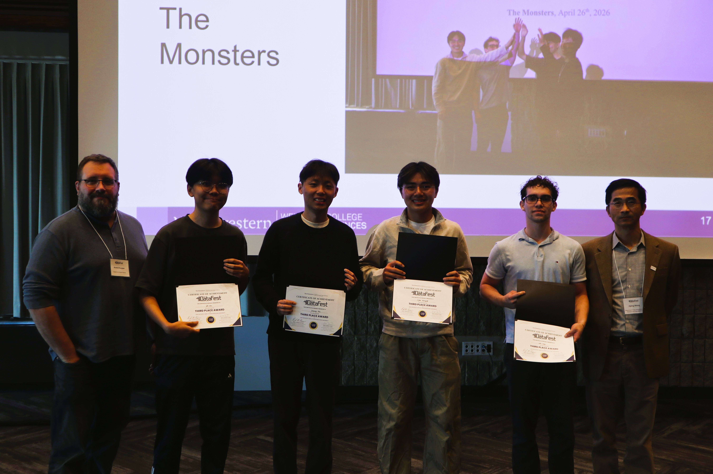
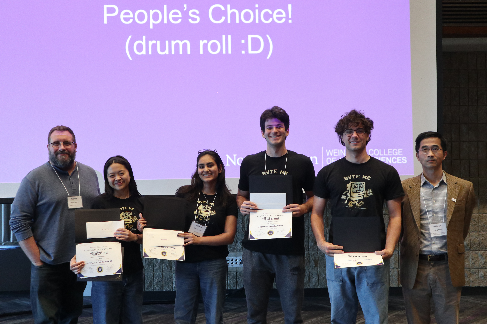

After 3.5 hours of team presentations and nearly an hour of thoughtful deliberation by the judges, **4 standout teams (out of 14) emerged as the winners** of DataFest 2026. Teams were evaluated on the quality of their recommendations, soundness of analysis, clarity of presentation, data visualization, use of external data, and overall creativity.

## 1. **First Place Award - Lakeside Data Center**{style="color:#4E2A84;"}
*(Emmanuel)*

**Presentation title:** Patient Treatment Adherence Analysis

**Mentors:** Jeffrey Yuan & Moses Chan

{width=80%}

- Emmanuel **identified a very specific, consequential problem** inspired from his own life: fracture patients who make an initial visit but do not return for needed follow-up care. He made the clinical and financial stakes immediately clear.
- He **moved from descriptive analysis to a practical decision tool**: a patient-classification and outreach-prioritization system that tells staff whom to contact, when to contact them, and why.
- The analysis **connected actionable drivers**—especially geographic variation and MyChart activation—**to a concrete intervention**: targeted reminders, calls, and care coordination.
- Emmanuel showed strong analytical maturity by **emphasizing interpretability**, patient-level prediction, class imbalance, regularization, and limitations in the available data, and answered judges questions convincingly
- **Why it won:** It was the most **complete end-to-end solution**: a compelling problem, credible analysis, a usable prototype, solid answers to judges' questions, and a clear path from prediction to intervention and savings.

## 2. **Second Place Award - The Perfect Fit**{style="color:#4E2A84;"}
*(Sophia, Hannah, Kay, Takeshi & Selina)*

**Mentors:** Isabel Knight & Shengbin Ye

{width=80%}

- The team identified a specific problem - geographic inequity**gave the analysis a memorable human frame through Emre's story ** making geographic inequity and long travel burdens feel tangible rather than abstract.
- Their **recommendations were practically actionable** and data driven: new clinics or partnerships, improved digital scheduling, community access hubs, and a real-time journey dashboard.
- The **deck was especially polished visually**, using maps, care-journey diagrams, and a clear narrative arc from patient problem to solution.
- **Why it won:** It combined a **strong equity-centered story** with visually effective analysis and thoughtful, **practically implementable recommendations** that could improve access in both rural and underserved areas.

## 3. **Third Place Award - The Monsters**{style="color:#4E2A84;"}
*(Joonsung, Colin, Jet & Dylan)*

**Mentors:** Sutter Augur & Karthik Prabhu

{width=80%}

- The team introduced a distinctive and **technically strong idea**: a two-step Markov-chain model that forecasts what is likely to happen next in a patient’s care pathway.
- They **translated the model into concrete operational findings**—for example, predicting ED-return risk, anticipating imaging bottlenecks, and forecasting rehab and skilled-nursing demand several days ahead.
- They connected care-path fragmentation to hospital finances, using external payment benchmarks to show how avoidable repeat encounters can create excess costs.
- Their **recommendations were highly implementable**: better advance staffing, earlier bed planning, targeted care coordination, and a phased rollout using existing EHR data.
- **Why it won:** It stood out for combining an original, **interpretable modeling approach with highly specific operational decisions** that hospital managers could act on quickly.

**What made the three winning teams stand out** was their ability to: (1) identify a focused and meaningful problem, (2) develop technically sound, interpretable analyses that led to practical, actionable recommendations, and (3) defend their methods, findings, and choices thoughtfully in response to the judges’ questions.

## 4, **People's Choice Award - Byte Me**{style="color:#4E2A84;"}
*(Fiona, Ashley, Zara, Samuel, & Benjamin)*

**Mentor:** Cara Chang & Karthik Prabhu

{width=80%}

Byte Me stood out as the most enthusiastic team at DataFest. They even **printed and wore their own team T-shirts**, and introduced themselves with a musical backgdrop. Their energy, positivity, and sense of fun resonated strongly with the audience. Their award reflected not only the quality of their work, but also the memorable and engaging way they brought the DataFest spirit to life.
